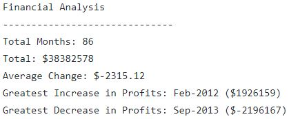
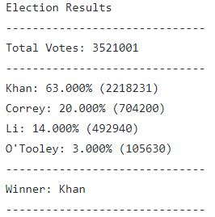

# python-challenge
 Jamie Tan Python Challenge submission
 
 # PyBank
 
The goal is to create a Python script for analyzing the financial records of your company. The financial data provided is in csv format. The dataset is composed of two columns: Date and Profit/Losses.

# PyPoll

The goal is to help a small, rural town modernize its vote counting process with Python. The poll data provided is in csv format. The dataset is composed of three columns: Voter ID, County, and Candidate.

